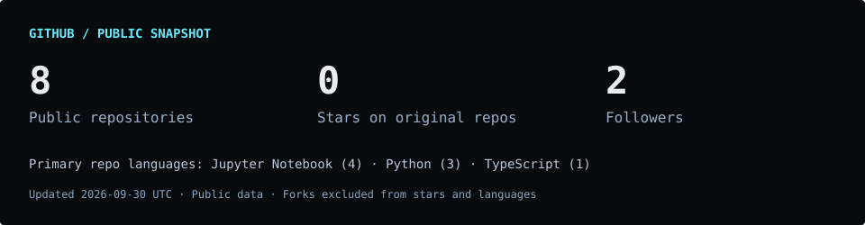

<!-- Generated from profile.json by scripts/build_profile.py. Edit the config, then rebuild. -->

  

<a href="https://www.kaggle.com/mann14">Kaggle</a> &nbsp; / &nbsp; <a href="https://github.com/Mann-Raval">GitHub</a> &nbsp; / &nbsp; <a href="https://github.com/Mann-Raval?tab=repositories">Explore my work ↗</a>

---

### Hey, I'm Mann Raval 👋

I build machine learning projects and web applications. My work spans recommendation systems, image classification, and tools that turn complex workflows into usable software.

**A few things you'll find here**

- Experiments with data and machine learning.
- Projects that connect models to usable interfaces.
- Web applications built around practical workflows.

 

## 🛠️ Tech stack

<h3 align="center">💻 Full Stack Development</h3>

<h3 align="center">🧠 Machine Learning &amp; Data</h3>

<h3 align="center">⚙️ Project Tools &amp; Infrastructure</h3>

## 🐍 Watch my contributions get eaten

<picture>
  <source media="(prefers-color-scheme: dark)" srcset="assets/github-snake-dark.svg" />
  
</picture>

## 🚀 Selected work

<table>
<tr>
<td width="50%" valign="top">
FULL STACK
<h3><a href="https://github.com/Mann-Raval/pulse-studio">Pulse Studio</a></h3>

Agency project and task management with role-based workflows and real-time updates.

TypeScript · React · Node.js · PostgreSQL
</td>
<td width="50%" valign="top">
MACHINE LEARNING
<h3><a href="https://github.com/Mann-Raval/Game-Recommendation-System">Game Recommendation System</a></h3>

Discover similar games through content-based filtering and an interactive Streamlit app.

Python · scikit-learn · Streamlit
</td>
</tr>
<tr>
<td width="50%" valign="top">
COMPUTER VISION
<h3><a href="https://github.com/Mann-Raval/Chest-X-ray-CNN">Chest X-ray CNN</a></h3>

A notebook exploring image preprocessing, CNN training, and chest X-ray classification.

Python · Jupyter · CNN
</td>
<td width="50%" valign="top">
MACHINE LEARNING
<h3><a href="https://github.com/Mann-Raval/ai-fake-news-detector">AI Fake News Detector</a></h3>

Exploring fake news detection with machine learning.

Python · Jupyter
</td>
</tr>
</table>

<a href="https://github.com/Mann-Raval?tab=repositories">Browse all repositories →</a>

## 📊 GitHub statistics

## 🤝 Let's connect

Explore my projects, follow along on GitHub, or find my data science work on Kaggle.

<a href="https://www.kaggle.com/mann14">Kaggle</a> &nbsp; / &nbsp; <a href="https://github.com/Mann-Raval">GitHub</a>

---

Curiosity → experiments → useful software. Like this layout? <a href="docs/SETUP.md">Make it yours.</a>

